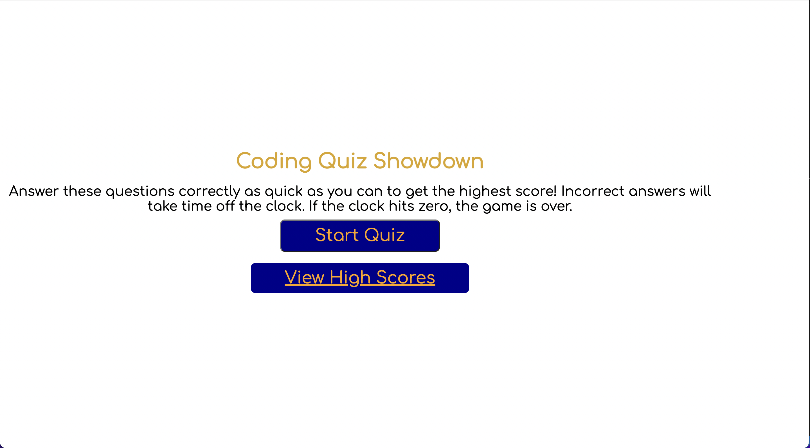
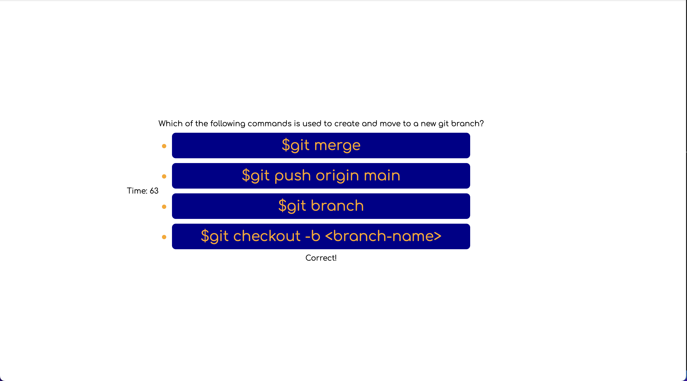

# Challenge 4: Web APIs Coding Quiz

## Description
A simple coding quiz that tracks high scores. The quiz is timed, and a wrong answer will subtract time from the clock, which is used to keep score.

## Table of Contents
- [Demonstration](#demonstration)
- [Usage](#usage)
- [Credits](#credits)
- [Questions](#questions)

## User Story

```
AS A coding boot camp student
I WANT to take a timed quiz on JavaScript fundamentals that stores high scores
SO THAT I can gauge my progress compared to my peers
```

## Demonstration
Upon opening the app, users will be met with this page:

When the game is started it will look like this:


## Usage
Visit this link to see the site in action:
https://jackatkerson.github.io/atkerson-code-quiz/

## Credits
Made by: Jack Atkerson

## Questions
Feel free to reach out to me at:
[E-Mail](mailto:jatkerson18@gmail.com),
[GitHub](https://github.com/JackAtkerson)
